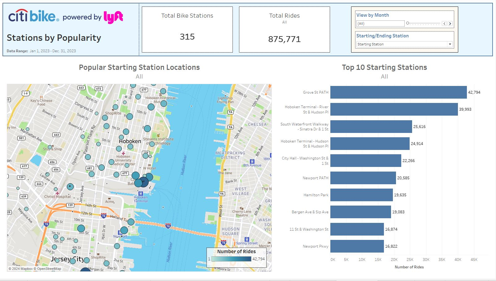
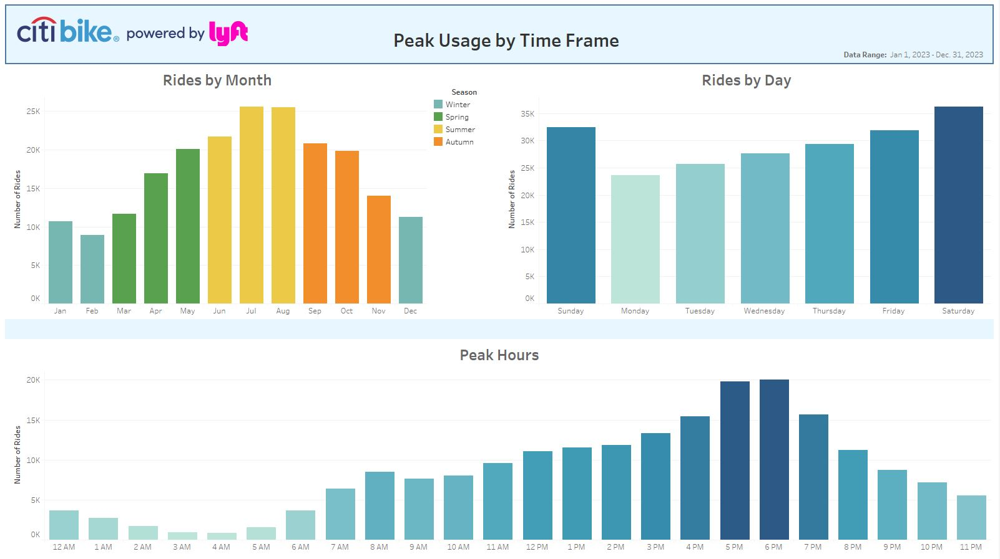
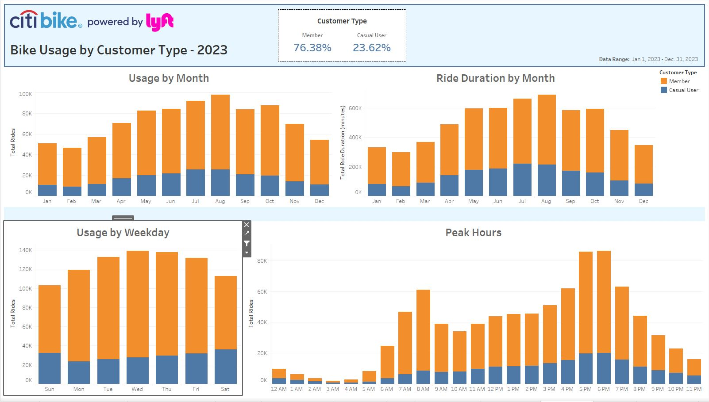
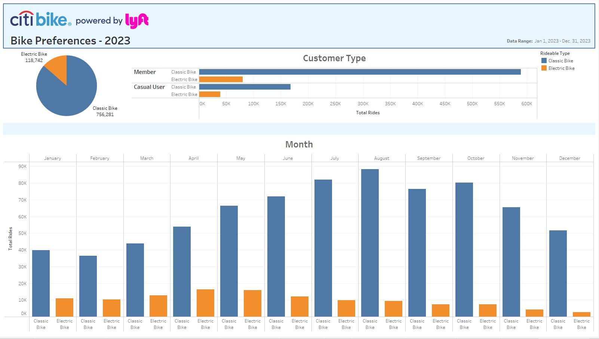

# Module 18 CitiBike Dashboard
*Tableau Challenge - Week 18 - Data Analytics Boot Camp - University of Oregon*

## Background
Congratulations on your new job! As the new lead analyst for the New York Citi BikeLinks to an external site. program, you are now responsible for overseeing the largest bike-sharing program in the United States. In your new role, you will be expected to generate regular reports for city officials looking to publicize and improve the city program.

Since 2013, the Citi Bike program has implemented a robust infrastructure for collecting data on the program's utilization. Each month, bike data is collected, organized, and made public on the Citi Bike DataLinks to an external site. webpage.

However, while the data has been regularly updated, the team has yet to implement a dashboard or sophisticated reporting process. City officials have questions about the program, so your first task on the job is to build a set of data reports to provide the answers.

## Analysis
For this project, I wanted to look a a full year's worth of data to see how bike usage and customers vary throughout the year.  I chose data from 2023 (Jan 1, 2023 - Dec 31, 2023).  

The data was cleaned and compiled in Python.  I combined 12 CSV's (one for each month) into a single dataframe.  I then calculated ride duration and added it to a new column.  I  removed any duration of 1 minute or less, as this would not reflect an actual trip as these may be potentially false starts or users trying to re-dock a bike to ensure it's secure.  Finally, I also found the quartiles and identified any outliers and removed them from the dataset.  
My Python Jupyter Notebook is included in this repository for reference.

- **Tableau Workbook:**  [Live Demo](https://public.tableau.com/app/profile/travis.cook3766/viz/Module18-CityBike/CitiBikebyLyft)
- **Data Source:**  [CitiBike](https://citibikenyc.com/system-data)

### Bike Stations by Popularity
Grove St. Path and Hoboken Terminal River St & Hudson Place are the busiest locations for both starting and ending points.  Bike capacity and inventory at both of these locations should be maintained.  It may be worth looking to see if these stations should be expanded based customer need for both available of bikes as well as empty docks for returning bikes.

### Peak Usage by Time Frame
Summer months are very popular, especially in July and August.  Weekend usage is the highest, which suggests bikes are often being used for leisure activities.  If we filter by weekends only, we can see that usage remains consistent throughout the day between 10am and 5pm.  

If filtered by weekdays only, bike usage increase around 7am and 8am, and peaks again around 5pm and 6pm.  This suggests that bikes are being utilized by commuters to get to and from their workplace.  There is a significant peak during the evening, which shows a much higher demand as commuters use more bikes instead of other modes of transportation to get home at the end of the day.

### Bike Usage by Customer Type
Both members and casual users take advantage of the bikes during the warmer months and usage typically slows down during the winter months.  However, members tend to utilize the bikes consistently throughout the year than casual users.

Looking at the usage by weekday, we can see that members will use the bikes mostly on the weekdays, whereas casual users will use the bikes more on the weekends.  This suggests that casual users tend to use the bikes for leisure activities rather than necessity.  While members are more likely using the bikes for utility and commuting.

### Classic & Electric Bike Preferences
Classic style of bikes are much more popular than electric bikes.  Members prefer classic bike almost 8:1 than electric bikes.  Casual users prefer classic bikes 4:1 to electric bikes.  Casual users are more likely to use electric bikes.  Perhaps due to the novel nature of electric bikes.  It would be worth gathering survey data on bike preferences among both members and casual users to see if investment in electric bikes is worth the cost.

Interestingly, use of electric bikes declines in popularity throughout the year, whereas the use of classic bikes goes up during the warmer months.

This discrepancy may be due to the supply of electric bikes vs classic bikes.  Electric bikes may also need more maintenance and are more likely to be pulled out of service for maintenance.  Additional data around bike inventory and maintenance would be needed for further analysis.

